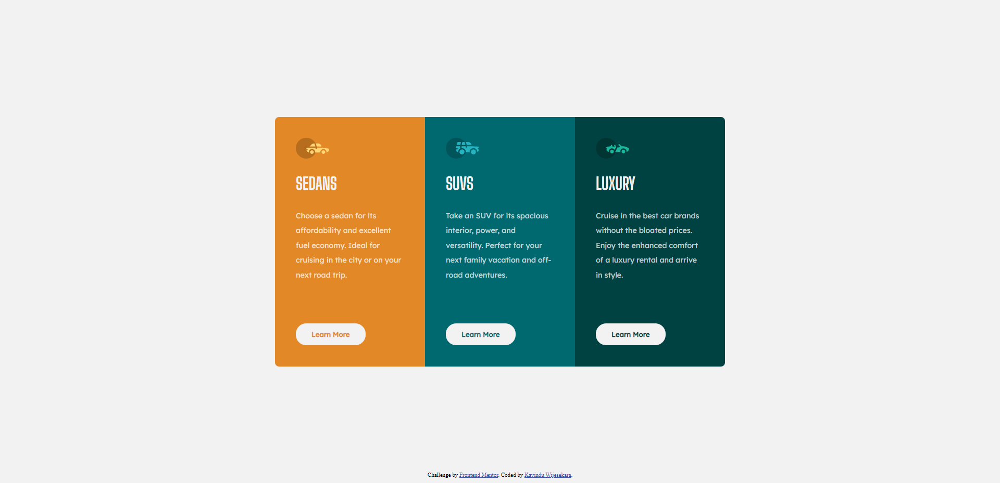

# Frontend Mentor - 3-column preview card component solution

This is a solution to the [3-column preview card component challenge on Frontend Mentor](https://www.frontendmentor.io/challenges/3column-preview-card-component-pH92eAR2-). Frontend Mentor challenges help you improve your coding skills by building realistic projects. 

## Table of contents

- [Overview](#overview)
  - [The challenge](#the-challenge)
  - [Screenshot](#screenshot)
  - [Links](#links)
- [My process](#my-process)
  - [Built with](#built-with)
  - [What I learned](#what-i-learned)
- [Author](#author)

**Note: Delete this note and update the table of contents based on what sections you keep.**

## Overview

### The challenge

Users should be able to:

- View the optimal layout depending on their device's screen size
- See hover states for interactive elements

### Screenshot




### Links

- Solution URL: [Click here to see solution](https://www.frontendmentor.io/solutions/3column-preview-card-component-ZMnEgmybOC)
- Live Site URL: [Click here to preview the website](https://ktmogo.github.io/3-column-preview-card-component-solution/)

## My process

### Built with

- Semantic HTML5 markup
- CSS custom properties
- Flexbox


### What I learned


```css
button:hover {
    outline-color: var(--very-light-gray);    
    outline-style: solid;
    outline-width: 2px;
    background-color: transparent;
    color: var(--very-light-gray);
    font-weight: normal;
}
```

## Author

- Frontend Mentor - [@KtMoGo](https://www.frontendmentor.io/profile/KtMoGo)
- Twitter - [@KavinduT8456](https://twitter.com/KavinduT8456)
